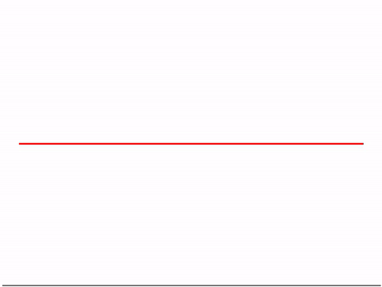
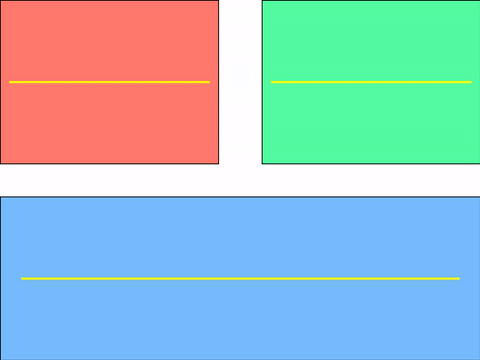

# videofig
Lightweight image sequence visualization utility based on matplotlib

## Features
- play matplotlib plots in real time (35 fps for 640x360 images) 
- pause, next frame, previous frame, etc
- drag the scroll bar for navigation
- draw multiple plots with grid specification
- save plots in a directory
- support windows, linux, osx

## Examples
### Example 1: Plot a dynamic sine wave


### Example 2: Show images together with object bounding boxes


### Example 3: Show multiple plots


To generate these gifs, follow these steps:
1. change `SAVE_PLOTS` to `True` in respective example scripts
2. `python example1.py` 
3. `ffmpeg -ss 0 -i example1_save/%04d.jpg -vf "setpts=1.0*PTS,fps=25,scale=480:-1:flags=lanczos,split[s0][s1];[s0]palettegen[p];[s1][p]paletteuse" -loop 0 example1_save.gif`

## Introduction
Python is an elegant programming language with rich add-on libraries to meet various needs. For scientific computation, it has `numpy`; for plotting, it has `matplotlib`. Personally, I use Python for video analysis and it works like a charm except for one thing: *visualize image sequences for detailed inspection*. 
 
When visualizing image sequences for detailed inspection, it is desirable to have `play`, `pause`, `forward by one frame`, `backward by one frame`, etc utilities. Moreover, we may add some custom plots(bounding box, for example) and graphics on top. In Matlab, we have `VideoPlayer` in `Computer Vision System Toolbox`, but to the best of my knowledge, there isn't any tools in Python that provides similar functionality. Let me know, if there are any : )
 
Accidentally, I came across [the excellent script of João Filipe Henriques](https://www.mathworks.com/matlabcentral/fileexchange/29544-figure-to-play-and-analyze-videos-with-custom-plots-on-top?focused=5172704&tab=function
), which provides utilities for detailed image sequence inspection before `VideoPlayer` is available in Matlab. Inspired by this, I decided to write a similar function in Python before more sophisticated tools come out.

## Dependency
This tool is specifically designed to be minimal, lightweight and readable such that anyone can easily modify it to suit different needs. The only dependency is `Matplotlib`. I have tested it in Python 2.7, but it should also work in Python 3.5.

- matplotlib >= 2.0.0
 
## Basic Usage
```python
videofig(NUM_FRAMES, REDRAW_FUNC)
```

Creates a figure with a horizontal scrollbar and shortcuts to scroll automatically.
The scroll range is 0 to NUM_FRAMES - 1. The function REDRAW_FUN(F, AXES) is called to
redraw at scroll position F (for example, REDRAW_FUNC can show the frame F of a video)
using AXES for drawing. F is an integer, AXES is a instance of [Axes class](https://matplotlib.org/api/axes_api.html)

This can be used not only to play and analyze standard videos, but it also lets you place
any custom Matplotlib plots and graphics on top.

The keyboard shortcuts are:
+ Enter(Return) -- play/pause video (25 frames-per-second default).
+ Backspace -- play/pause video 5 times slower.
+ Right/left arrow keys -- advance/go back one frame.
+ Page down/page up -- advance/go back 30 frames.
+ Home/end -- go to first/last frame of video.

## Advanced Usage
```python
videofig(NUM_FRAMES, REDRAW_FUNC, FPS, BIG_SCROLL)
```
Also specifies the speed of the play function (frames-per-second) and
the frame step of page up/page down (or empty for defaults).

```python
videofig(NUM_FRAMES, REDRAW_FUNC, FPS, BIG_SCROLL, KEY_FUNC)
```
Also calls KEY_FUNC(KEY) with any keys that weren't processed, so you
can add more shortcut keys (or empty for none).


